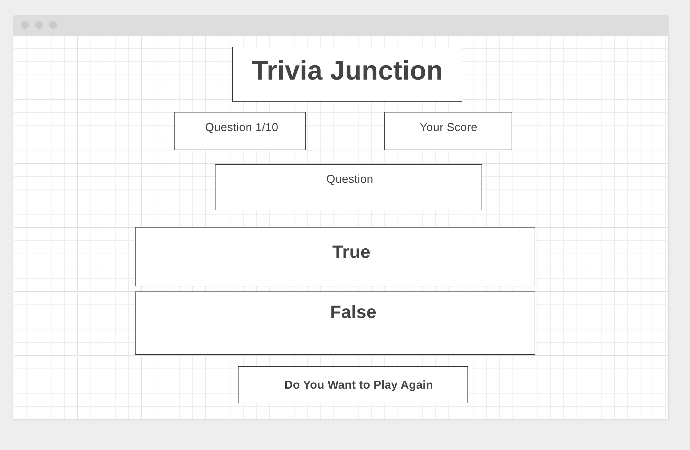

# Trivia_Junction
# A True/False Trivia Game 
# The Questions are from many categories and three difficulty levels
* Trivia game with questions from various categories and difficulty levels separated into true/false questions. 
* The game begins with the game board showing the question counter on the top left at (Question 1/10) and the score showing 0 in the Your Score section in the top right.
* The true/false questions will load just below the question counter and the score. The player will examine the question and decide on a true/false answer.
 There are two container (buttons) below the question labeled (True) and (False). The player will make a choice to select either the True or False container (button) to answer the true/false question correctly.
* Once the answer choice selection is made by the player, the container (button) will change color, turning green for a correct answer or turning red for an incorrect answer.
* If the answer choice selection turns green and is correct, a score unit of 5 will be added to the Your Score counter.
* If the answer choice selection turns red and is incorrect, no score unit will be added to the Your Score counter.
* After the answer choice selection is made, and the score counter is updated if needed, the next true/false question will be generated.
* New true false questions will be generated after each question is answered, regardless if the answer is correct or incorrect until the total questions equals 10 of 10.
* The score units, at 5 each, will tally up for each correct answer, giving a grand total score at the end of the 10 question play.
* At the point when the Question total reaches 10 of 10 (Question 10/10) the player will then have the opportunity to select "Do You Want To Play Again" button to restart the game.
* Link to the Trello Board [https://trello.com/b/9iZOWsWE/ga-project-1] 
* Link to the Wireframe - Wireframe-1 [https://wireframe.cc/aiDVvk]
* Link to the API [https://opentdb.com/api.php]

 

